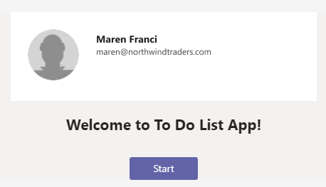
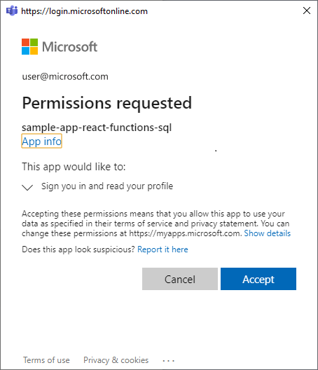

# Getting Started with Todo List Sample (Azure)

> Note: Please be advised that this sample repository is currently in **Public Preview**, with a lot of active development work taking place. Please expect breaking changes as we continue to iterate. 
> 
> We really appreciate your feedback! If you encounter any issue or error, please report issues to us following the [Supporting Guide](./../SUPPORT.md). Meanwhile you can make [recording](https://aka.ms/teamsfx-record) of your journey with our product, they really make the product better. Thank you!
>  
> This warning will be removed when the samples are ready for production.

Todo List provides an easy way to manage to-do items in Teams Client. This app helps enabling task collaboration and management for your team. The frontend is a React app and the backend is hosted on Azure. You will need an Azure subscription to run the app.


## Prerequisite
- [NodeJS](https://nodejs.org/en/)
- An M365 account. If you do not have M365 account, apply one from [M365 developer program](https://developer.microsoft.com/en-us/microsoft-365/dev-program)
- [Teams Toolkit Visual Studio Code Extension](https://aka.ms/teams-toolkit)
- An [Azure subscription](https://azure.microsoft.com/en-us/free/)

## What you will learn in this sample:

- How to use TeamsFx to build frontend hosting on Azure for your tab app.
- How to use TeamsFx to build backend hosting on Azure for your tab app.
- How to connect to Azure SQL DB and how to do CRUD operations in DB.
- How to use MS graph client in TeamsFx to get access to M365 data.
- How to use TeamsFx simple auth capability to get Teams user login information.

## Try the Sample with Visual Studio Code Extension:
>Here are the instructions to run the sample in **Visual Studio Code**. You can also try to run the app using TeamsFx CLI tool, refer to [Try the Sample with TeamsFx CLI](cli.md)
1. Clone the repo to your local workspace or directly download the source code.
1. Download [Visual Studio Code](https://code.visualstudio.com) and install [Teams Toolkit Visual Studio Code Extension](https://aka.ms/teams-toolkit).
1. Open the project in Visual Studio Code.
1. Open the command palette and select `Teams: Provision in the Cloud`. You will be asked to input admin name and password of SQL. The toolkit will help you to provision Azure SQL.
1. Once provision is completed, open the command palette and select `Teams: Deploy to the Cloud`.
1. Open [.fx/env.default.json](.fx/env.default.json) file, you could get the database name in `databaseName` setting. In Azure portal, find the database and use [query editor](https://docs.microsoft.com/en-us/azure/azure-sql/database/connect-query-portal) with below query to create a table:
    ```sql
    CREATE TABLE Todo
    (
        id INT IDENTITY PRIMARY KEY,
        description NVARCHAR(128) NOT NULL,
        objectId NVARCHAR(36),
        channelOrChatId NVARCHAR(128),
        isCompleted TinyInt NOT NULL default 0,
    )
    ```
1. Once deployment is completed, you can preview the app running in Azure. In Visual Studio Code, open `Run and Debug` and select `Launch Remote (Edge)` or `Launch Remote (Chrome)` in the dropdown list and Press `F5` or green arrow button to open a browser.

## (Optional) Debug

To debug the project, you will need to configure an Azure SQL Database to be used locally:
1. [Create an Azure SQL Database](https://docs.microsoft.com/en-us/azure/azure-sql/database/single-database-create-quickstart?tabs=azure-portal)
1. [Add IP address of your computer into allowlist of firewall of Azure SQL Database](https://docs.microsoft.com/en-us/azure/azure-sql/database/firewall-configure#from-the-database-overview-page)
1. Use [query editor](https://docs.microsoft.com/en-us/azure/azure-sql/database/connect-query-portal) with below query to create a table:
    ```sql
    CREATE TABLE Todo
    (
        id INT IDENTITY PRIMARY KEY,
        description NVARCHAR(128) NOT NULL,
        objectId NVARCHAR(36),
        channelOrChatId NVARCHAR(128),
        isCompleted TinyInt NOT NULL default 0,
    )
    ```
1. Open [.fx/local.env](.fx/local.env) file, and set the values of below config with the Azure SQL Database you just created:
    ```
    BACKEND_SQL_ENDPOINT=
    BACKEND_SQL_DATABASE_NAME=
    BACKEND_SQL_USER_NAME=
    BACKEND_SQL_PASSWORD=
    ```
1. Open Debug View (`Ctrl+Shift+D`) and select "Debug (Edge)" or "Debug (Chrome)" in dropdown list.
1. Press "F5" to open a browser window and then select your package to view todo list sample app. 

## Use the App in Teams

1. The app will look like this when it runs for the first time.

    
1. For the first time to run the app, you need to consent the app to get your profile information like your avatar. Click on "Accept" button to accept the Authorization.

    
1. You could try to add new todo item by typing item by clicking "Add task" button.
1. You could try to complete todo item by choosing the checkbox before the item.
1. You could try to update todo item by typing text in todo item list.
1. You could try to delete todo item by clicking "..." and then choose "delete" button.

## Architecture


- The frontend is a react tab app hosted on [Azure Storage](https://docs.microsoft.com/en-us/azure/storage/).
- The Backend server is hosted on [Azure Function](https://docs.microsoft.com/en-us/azure/azure-functions/) for managing posts in the tab app.
- The [Azure SQL DB](https://docs.microsoft.com/en-us/azure/azure-sql/) used to persist data.

### Code structure

- You can check app configuration and environment information in: [.fx](.fx)
- You will find frontend code in: [tabs/src/components](tabs/src/components)
- You will find backend code in: [api/todo](api/todo)
- You will find DB Connection code in: [api/todo/index.js](api/todo/index.js)
- You will find MS graph client code in: [tabs/src/components/Creator.js](tabs/src/components/Creator.js)

## Code of Conduct
This project has adopted the [Microsoft Open Source Code of Conduct](https://opensource.microsoft.com/codeofconduct/).

For more information see the [Code of Conduct FAQ](https://opensource.microsoft.com/codeofconduct/faq/) or
contact [opencode@microsoft.com](mailto:opencode@microsoft.com) with any additional questions or comments.
